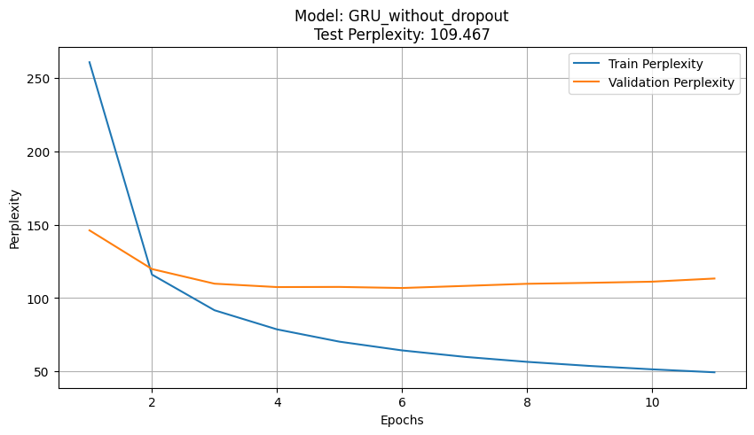

# RNN Regularization by Zaremba et al. (2014)

This repository contains an implementation and replication of the "Recurrent Neural Network Regularization" by Zaremba et al. (2014). The implementation uses the Penn Tree Bank (PTB) dataset for training and evaluating the models.

This project was done as homework for the Deep Learning course (0510725502) at Tel Aviv University.

The implemented models include:

LSTM without dropout
LSTM with dropout
GRU without dropout
GRU with dropout

## Table of Contents
- [Overview](#Overview)
- [Features](#Features)
- [Installation](#Installation)
- [Training](#training)
- [Evaluation](#evaluation)
- [Results](#results)
- [Acknowledgements](#acknowledgements)

## Overview
The codes evaluates performance on language modeling tasks when introducing dropout regularization for Recurrent Neural Networks (RNNs), particularly Long Short-Term Memory networks (LSTMs) and Gated Recurrent Unit (GRUs).

## Features
- Loading and visualizing the Penn Tree Bank dataset.
- Creating train and test splits.
- Defining RNN models with w/o regularization.
- Logging the model in TensorBoard.
- Training and evaluating the model using perplexity.
- Evaluating the trained model by perplexity and predicting sentence completion.

## Installation
Install the required dependencies:
```bash
pip install -r requirements.txt
```

## Training
Select your desired model
To train the model, in section 2:
```python
SELECTED_MODEL = 'LSTM_with_dropout' # 'LSTM_with_dropout' or 'LSTM_without_dropout' or 'GRU_with_dropout' or 'GRU_without_dropout'
SELECTED_CHECKPOINT = '' # Leave empty if you want to train from scratch
```
And run all cells in section 3.
This will train the model on the PTB dataset and evaluate its performance using perplexity, and save checkpoints into `./models/checkpoints`.

## Evaluating
If you wish to simpy evaluated your new trained model from section 3, proceed with running section 4.
Otherwise, select your trained model with checkpoint in section 2:
```python
SELECTED_MODEL = 'LSTM_with_dropout' # 'LSTM_with_dropout' or 'LSTM_without_dropout' or 'GRU_with_dropout' or 'GRU_without_dropout'
SELECTED_CHECKPOINT = '/models/LSTM_with_dropout/best_validation_model.pt' # Leave empty if you want to train from scratch
```

And load it by running all cells up to trainer:
```python
trainer = Trainer(optimizer, criterion, BPTT, BATCH_SIZE, N_EPOCHS, SELECTED_MODEL)
```

Now run Section 4: Evaluation, to get the test split perplexity on the model:
```python
test_loss, test_perplexity = trainer.evaluate(model, test_data)
print(f'Test Loss: {test_loss:.3f}, Test Perplexity: {test_perplexity:.3f}')
```

## Generating Text
To evaluate a sentence completion task, fill in the `start_text` variable:
```python
start_text = "The capital"
```

And run following code in cells:
```python
generated_sentence = generate_sentence(model, vocab, tokenizer, start_text)
print(f"Start sentence: {start_text}")
print(f"Generated completion: {generated_sentence}")
```


## Results

All results were performed with the following hyperparameters:
```python
BATCH_SIZE = 64
BPTT = 20 # backpropagation through time defines sentence length
LEARNING_RATE = 5
MIN_LEARNING_RATE = LEARNING_RATE/10 # minimum learning rate for the scheduler
MAX_GRAD_NORM = 2
WEIGHT_DECAY = 1e-5
EMBEDDING_DIM = 200
HIDDEN_DIM = 200
N_LAYERS = 2 # number of layers in the RNN
DROPOUT = 0.5 # dropout rate (if used)
MAX_EPOCHS = 50

optimizer = optim.SGD(model.parameters(), lr=LEARNING_RATE, weight_decay=WEIGHT_DECAY)
scheduler = optim.lr_scheduler.CosineAnnealingLR(optimizer, T_max=MAX_EPOCHS, eta_min=MIN_LEARNING_RATE)
```

### LSTM without dropout
The model converged quite early, with a significant difference observed between the validation and training perplexities. This early convergence might indicate that the model has overfitted to the training data, capturing noise rather than generalizable patterns. The lack of dropout likely contributed to this overfitting, as the model could rely too heavily on specific paths through the network during training, leading to poorer generalization to unseen validation data.


Despite the early convergence, this model's performance highlights the importance of regularization techniques like dropout to prevent overfitting, especially in recurrent neural networks where dependencies can be complex and long-range.

### LSTM with dropout
The LSTM model with dropout took longer to train but achieved much better results. As expected with dropout layers, the model was able to generalize better, evidenced by the closer alignment of training and validation perplexities. Dropout helped to prevent overfitting by randomly deactivating neurons during training, which forced the network to learn more robust features.


The training was capped at 50 epochs upon reaching satisfactory results, although the training curve suggests that the model had not yet fully plateaued. This indicates that with additional training time, the model could potentially achieve even better performance, further reducing the perplexities.

### GRU without dropout

The GRU model without dropout exhibited similar behavior to the LSTM without dropout. It converged quickly with a noticeable gap between the training and validation perplexities. This gap indicates overfitting, where the model performs well on the training data but poorly on the validation data. The absence of dropout likely allowed the model to memorize the training data rather than learning to generalize from it.



The results underscore the need for regularization in GRU models to improve generalization and reduce the risk of overfitting.

### GRU with dropout

The GRU model with dropout showed improved training dynamics, similar to the LSTM with dropout. It took longer to train compared to its non-dropout counterpart but demonstrated much better generalization capabilities. The training and validation perplexities were more closely aligned, indicating that the dropout mechanism effectively prevented overfitting.


This model's performance highlights the effectiveness of dropout in recurrent neural networks, especially GRUs, in promoting generalization and robustness in the learned representations. The model's perplexity curves suggest that it could potentially benefit from additional epochs, similar to the LSTM with dropout.

### Comparison

| Model                       | Train Perplexity | Validation Perplexity | Test Perplexity |
|-----------------------------|----------------|---------------|---------------|
| LSTM without Dropout              | 46.00         | 101.456        |  97.13|
| LSTM with Dropout         | 59.55         | 81.02        |78.05|
| GRU without Dropout | 59.16     | 106.86        | 103.56 |
| GRU with Dropout    | 59.16         | 84.198        |  81.60 |

## References
- **Recurrent Neural Network Regularization by Zaremba et al. (2014)**:
  - Paper link: [Recurrent Neural Network Regularization (arxiv.org)](https://arxiv.org/abs/1409.2329)
  - Paper link: [Long Short-Term Memory (LSTM) (scholarpedia.org)](http://www.scholarpedia.org/article/Long_Short-Term_Memory)
  - Paper link: [Neural Machine Translation by Jointly Learning to Align and Translate (arxiv.org)](https://arxiv.org/abs/1409.0473)

- **GitHub Repositories**:
  - [ahmetumutdurmus/zaremba](https://github.com/ahmetumutdurmus/zaremba)


